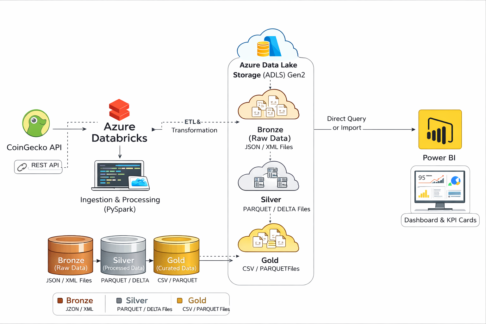

# End-to-End Azure Data Engineering Pipeline for Cryptocurrency Analytics

## Project Overview

This project implements an end-to-end data engineering pipeline using Microsoft Azure to ingest, process, and analyze cryptocurrency market data. The pipeline collects data from the CoinGecko API, stores raw data in Azure Data Lake Storage, performs transformations using PySpark in Azure Databricks, and generates analytical insights through Power BI dashboards.

The project demonstrates modern data engineering practices including data lake architecture, distributed processing, automated ETL workflows, and business intelligence integration.

## Architecture

The pipeline follows a modern cloud-based data engineering architecture:

CoinGecko API  
↓  
Azure Data Lake Storage (Raw Layer)  
↓  
Azure Databricks (PySpark ETL Processing)  
↓  
Azure Data Lake Storage (Curated Layer)  
↓  
Power BI Dashboard

## Technologies Used

- Microsoft Azure
- Azure Data Lake Storage Gen2
- Azure Databricks
- Apache Spark (PySpark)
- Databricks Jobs for workflow automation
- Power BI for data visualization
- CoinGecko API for cryptocurrency market data

## Data Pipeline Workflow

### 1. Data Ingestion
Cryptocurrency market data is collected from the CoinGecko API. The raw JSON response is stored in the Raw container of Azure Data Lake Storage to preserve the original source data.

### 2. Data Transformation
Azure Databricks processes the raw data using PySpark. The transformation process includes:
- Schema validation
- Column selection and cleaning
- Data enrichment with timestamps
- Flattening nested fields
- Aggregation and metric computation

### 3. Data Storage
The transformed data is written to the Curated layer of Azure Data Lake Storage in Parquet format for efficient analytics and querying.

### 4. Data Analytics
Power BI connects to the curated dataset and generates interactive dashboards to analyze cryptocurrency market trends and performance.

## Data Lake Architecture

The project follows a layered data lake architecture:

Raw Layer
- Stores original API data in JSON format
- Ensures traceability and reproducibility

Processed Layer
- Contains intermediate cleaned datasets

Curated Layer
- Stores analytics-ready datasets in Parquet format
- Optimized for Power BI consumption

## Key Data Transformations

- Filtering relevant columns from raw API data
- Handling missing values
- Converting timestamp fields
- Flattening nested JSON structures
- Computing market metrics such as:
  - Market capitalization
  - Trading volume
  - Distance from All-Time High
- Generating latest snapshot records using Spark window functions

## Job Scheduling

- Used Azure DataBricks Jobs for triggering the ETL Notebook.
- Set a daily timer for fetching new data daily from the API.
- Automated data fetching from API showcasing workflow automation without manual intervention.

## Dashboard Insights

The Power BI dashboard provides insights such as:

- Comparison of cryptocurrency market capitalizations
- Distance from All-Time High (ATH) analysis
- Market performance comparison across assets
- Market trend indicators.

## Future Improvements

- Implement incremental data ingestion
- Add orchestration using Azure Data Factory
- Implement Delta Lake for data versioning
- Add CI/CD pipeline for automated deployment
- Expand analytics with additional market indicators

## References

CoinGecko API Documentation  
Microsoft Azure Documentation  
Apache Spark Documentation  
Power BI Documentation
